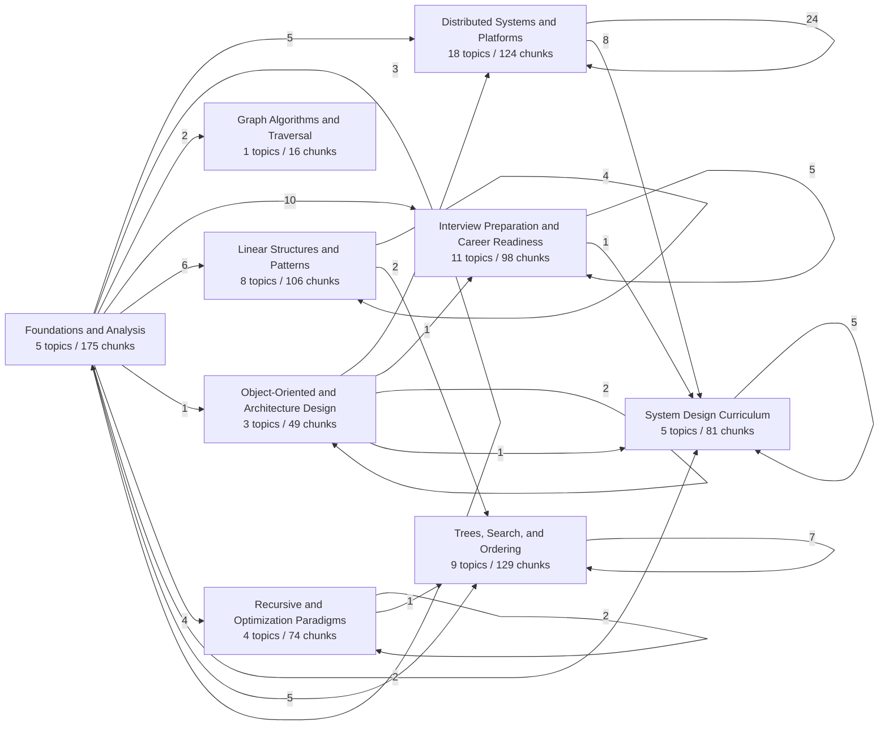
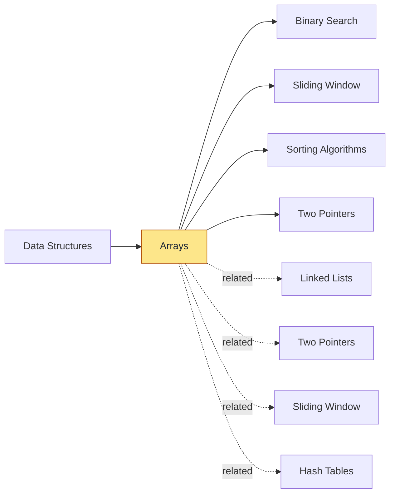

# Knowledge Graph

Generated from `knowledge-base.json`.

## Snapshot

- Topics: `64`
- Topic edges: `295`
- Planning coverage: `64/64`
- Missing refs: `0`
- Ambiguous refs: `0`
- Dropped prerequisite cycles: `0`
- Edge mix: `prerequisite=102`, `related=110`, `extends=52`, `variant-of=31`

## Bucket Overview

## Prerequisite DAG

```mermaid
flowchart TB
  subgraph bucket_distributed_systems_and_platforms["Distributed Systems and Platforms"]
    topic_topic_api_design["API Design"]
    topic_topic_caching_strategies["Caching Strategies"]
    topic_topic_cap_theorem["CAP Theorem"]
    topic_topic_cloud_computing["Cloud Computing"]
    topic_topic_computer_networking["Computer Networking"]
    topic_topic_concurrency["Concurrency"]
    topic_topic_consistent_hashing["Consistent Hashing"]
    topic_topic_database_sharding["Database Sharding"]
    topic_topic_database_systems["Database Systems"]
    topic_topic_devops_and_deployment["DevOps and Deployment"]
    topic_topic_distributed_systems["Distributed Systems"]
    topic_topic_internet_protocol["Internet Protocol"]
    topic_topic_ip_addressing_and_subnetting["IP Addressing and Subnetting"]
    topic_topic_load_balancing["Load Balancing"]
    topic_topic_microservices_architecture["Microservices Architecture"]
    topic_topic_operating_systems["Operating Systems"]
    topic_topic_site_reliability_engineering["Site Reliability Engineering"]
    topic_topic_sql_joins["SQL Joins"]
  end
  subgraph bucket_foundations_and_analysis["Foundations and Analysis"]
    topic_topic_active_recall_and_spaced_repetition["Active Recall and Spaced Repetition"]
    topic_topic_algorithms["Algorithms"]
    topic_topic_big_o_notation["Big O Notation"]
    topic_topic_data_structures["Data Structures"]
    topic_topic_programming_fundamentals["Programming Fundamentals"]
  end
  subgraph bucket_graph_algorithms_and_traversal["Graph Algorithms and Traversal"]
    topic_topic_graph_algorithms["Graph Algorithms"]
  end
  subgraph bucket_interview_preparation_and_career["Interview Preparation and Career Readiness"]
    topic_topic_behavioral_interview_preparation["Behavioral Interview Preparation"]
    topic_topic_coding_interview_preparation["Coding Interview Preparation"]
    topic_topic_coding_patterns["Coding Patterns"]
    topic_topic_competitive_programming["Competitive Programming"]
    topic_topic_front_end_interview_preparation["Front-End Interview Preparation"]
    topic_topic_machine_learning_interview_preparation["Machine Learning Interview Preparation"]
    topic_topic_open_source_contribution["Open Source Contribution"]
    topic_topic_resume_writing["Resume Writing"]
    topic_topic_salary_negotiation["Salary Negotiation"]
    topic_topic_technical_interview_preparation["Technical Interview Preparation"]
    topic_topic_whiteboard_coding["Whiteboard Coding"]
  end
  subgraph bucket_linear_structures_and_patterns["Linear Structures and Patterns"]
    topic_topic_arrays["Arrays"]
    topic_topic_bitwise_operations["Bitwise Operations"]
    topic_topic_hash_tables["Hash Tables"]
    topic_topic_linked_lists["Linked Lists"]
    topic_topic_queues["Queues"]
    topic_topic_sliding_window["Sliding Window"]
    topic_topic_stacks["Stacks"]
    topic_topic_two_pointers["Two Pointers"]
  end
  subgraph bucket_oop_and_architecture["Object-Oriented and Architecture Design"]
    topic_topic_object_oriented_design["Object-Oriented Design"]
    topic_topic_object_oriented_programming["Object-Oriented Programming"]
    topic_topic_software_architecture["Software Architecture"]
  end
  subgraph bucket_recursive_and_optimization_paradigms["Recursive and Optimization Paradigms"]
    topic_topic_backtracking["Backtracking"]
    topic_topic_dynamic_programming["Dynamic Programming"]
    topic_topic_greedy_algorithms["Greedy Algorithms"]
    topic_topic_recursion["Recursion"]
  end
  subgraph bucket_system_design_curriculum["System Design Curriculum"]
    topic_topic_front_end_system_design["Front-End System Design"]
    topic_topic_system_design["System Design"]
    topic_topic_system_design_clarification["System Design Clarification"]
    topic_topic_system_design_fundamentals["System Design Fundamentals"]
    topic_topic_system_design_interview_preparation["System Design Interview Preparation"]
  end
  subgraph bucket_trees_search_and_ordering["Trees, Search, and Ordering"]
    topic_topic_balanced_search_trees["Balanced Search Trees"]
    topic_topic_binary_search["Binary Search"]
    topic_topic_binary_search_trees["Binary Search Trees"]
    topic_topic_divide_and_conquer["Divide and Conquer"]
    topic_topic_heaps["Heaps"]
    topic_topic_merge_sort["Merge Sort"]
    topic_topic_sorting_algorithms["Sorting Algorithms"]
    topic_topic_trees["Trees"]
    topic_topic_trie["Trie"]
  end
  topic_topic_api_design --> topic_topic_front_end_system_design
  topic_topic_api_design --> topic_topic_microservices_architecture
  topic_topic_api_design --> topic_topic_system_design
  topic_topic_algorithms --> topic_topic_big_o_notation
  topic_topic_algorithms --> topic_topic_coding_interview_preparation
  topic_topic_algorithms --> topic_topic_coding_patterns
  topic_topic_algorithms --> topic_topic_competitive_programming
  topic_topic_algorithms --> topic_topic_divide_and_conquer
  topic_topic_algorithms --> topic_topic_dynamic_programming
  topic_topic_algorithms --> topic_topic_graph_algorithms
  topic_topic_algorithms --> topic_topic_greedy_algorithms
  topic_topic_algorithms --> topic_topic_machine_learning_interview_preparation
  topic_topic_algorithms --> topic_topic_sorting_algorithms
  topic_topic_algorithms --> topic_topic_system_design_fundamentals
  topic_topic_arrays --> topic_topic_binary_search
  topic_topic_arrays --> topic_topic_sliding_window
  topic_topic_arrays --> topic_topic_sorting_algorithms
  topic_topic_arrays --> topic_topic_two_pointers
  topic_topic_big_o_notation --> topic_topic_binary_search
  topic_topic_big_o_notation --> topic_topic_coding_interview_preparation
  topic_topic_big_o_notation --> topic_topic_competitive_programming
  topic_topic_big_o_notation --> topic_topic_greedy_algorithms
  topic_topic_big_o_notation --> topic_topic_sorting_algorithms
  topic_topic_binary_search --> topic_topic_binary_search_trees
  topic_topic_binary_search_trees --> topic_topic_balanced_search_trees
  topic_topic_caching_strategies --> topic_topic_consistent_hashing
  topic_topic_caching_strategies --> topic_topic_system_design
  topic_topic_coding_interview_preparation --> topic_topic_coding_patterns
  topic_topic_coding_interview_preparation --> topic_topic_front_end_interview_preparation
  topic_topic_coding_interview_preparation --> topic_topic_machine_learning_interview_preparation
  topic_topic_coding_interview_preparation --> topic_topic_technical_interview_preparation
  topic_topic_coding_interview_preparation --> topic_topic_whiteboard_coding
  topic_topic_computer_networking --> topic_topic_api_design
  topic_topic_computer_networking --> topic_topic_devops_and_deployment
  topic_topic_computer_networking --> topic_topic_distributed_systems
  topic_topic_computer_networking --> topic_topic_internet_protocol
  topic_topic_computer_networking --> topic_topic_load_balancing
  topic_topic_computer_networking --> topic_topic_system_design_fundamentals
  topic_topic_data_structures --> topic_topic_arrays
  topic_topic_data_structures --> topic_topic_coding_interview_preparation
  topic_topic_data_structures --> topic_topic_coding_patterns
  topic_topic_data_structures --> topic_topic_competitive_programming
  topic_topic_data_structures --> topic_topic_database_systems
  topic_topic_data_structures --> topic_topic_graph_algorithms
  topic_topic_data_structures --> topic_topic_hash_tables
  topic_topic_data_structures --> topic_topic_linked_lists
  topic_topic_data_structures --> topic_topic_queues
  topic_topic_data_structures --> topic_topic_stacks
  topic_topic_data_structures --> topic_topic_system_design_fundamentals
  topic_topic_data_structures --> topic_topic_trees
  topic_topic_database_systems --> topic_topic_caching_strategies
  topic_topic_database_systems --> topic_topic_database_sharding
  topic_topic_database_systems --> topic_topic_distributed_systems
  topic_topic_database_systems --> topic_topic_sql_joins
  topic_topic_database_systems --> topic_topic_system_design_fundamentals
  topic_topic_devops_and_deployment --> topic_topic_site_reliability_engineering
  topic_topic_distributed_systems --> topic_topic_cap_theorem
  topic_topic_distributed_systems --> topic_topic_caching_strategies
  topic_topic_distributed_systems --> topic_topic_cloud_computing
  topic_topic_distributed_systems --> topic_topic_consistent_hashing
  topic_topic_distributed_systems --> topic_topic_database_sharding
  topic_topic_distributed_systems --> topic_topic_load_balancing
  topic_topic_distributed_systems --> topic_topic_microservices_architecture
  topic_topic_distributed_systems --> topic_topic_site_reliability_engineering
  topic_topic_distributed_systems --> topic_topic_system_design
  topic_topic_divide_and_conquer --> topic_topic_merge_sort
  topic_topic_front_end_interview_preparation --> topic_topic_front_end_system_design
  topic_topic_hash_tables --> topic_topic_sliding_window
  topic_topic_internet_protocol --> topic_topic_ip_addressing_and_subnetting
  topic_topic_load_balancing --> topic_topic_site_reliability_engineering
  topic_topic_load_balancing --> topic_topic_system_design
  topic_topic_object_oriented_design --> topic_topic_software_architecture
  topic_topic_object_oriented_design --> topic_topic_system_design_fundamentals
  topic_topic_object_oriented_programming --> topic_topic_object_oriented_design
  topic_topic_object_oriented_programming --> topic_topic_technical_interview_preparation
  topic_topic_operating_systems --> topic_topic_concurrency
  topic_topic_operating_systems --> topic_topic_distributed_systems
  topic_topic_operating_systems --> topic_topic_system_design_fundamentals
  topic_topic_programming_fundamentals --> topic_topic_api_design
  topic_topic_programming_fundamentals --> topic_topic_algorithms
  topic_topic_programming_fundamentals --> topic_topic_bitwise_operations
  topic_topic_programming_fundamentals --> topic_topic_computer_networking
  topic_topic_programming_fundamentals --> topic_topic_data_structures
  topic_topic_programming_fundamentals --> topic_topic_devops_and_deployment
  topic_topic_programming_fundamentals --> topic_topic_object_oriented_programming
  topic_topic_programming_fundamentals --> topic_topic_open_source_contribution
  topic_topic_programming_fundamentals --> topic_topic_operating_systems
  topic_topic_programming_fundamentals --> topic_topic_recursion
  topic_topic_recursion --> topic_topic_backtracking
  topic_topic_recursion --> topic_topic_divide_and_conquer
  topic_topic_recursion --> topic_topic_dynamic_programming
  topic_topic_software_architecture --> topic_topic_microservices_architecture
  topic_topic_sorting_algorithms --> topic_topic_merge_sort
  topic_topic_system_design --> topic_topic_system_design_interview_preparation
  topic_topic_system_design_fundamentals --> topic_topic_front_end_system_design
  topic_topic_system_design_fundamentals --> topic_topic_system_design
  topic_topic_system_design_fundamentals --> topic_topic_system_design_clarification
  topic_topic_system_design_fundamentals --> topic_topic_system_design_interview_preparation
  topic_topic_trees --> topic_topic_binary_search_trees
  topic_topic_trees --> topic_topic_heaps
  topic_topic_trees --> topic_topic_trie
  topic_topic_two_pointers --> topic_topic_sliding_window
  classDef root fill:#d7f0ff,stroke:#1d4ed8,color:#0f172a;
  class topic_topic_active_recall_and_spaced_repetition,topic_topic_behavioral_interview_preparation,topic_topic_programming_fundamentals,topic_topic_resume_writing,topic_topic_salary_negotiation root;
```

## Focus Topic Review

### Arrays

- Bucket: `Linear Structures and Patterns`
- Prerequisites: Data Structures
- Unlocks: Binary Search, Sliding Window, Sorting Algorithms, Two Pointers
- Related topics: Hash Tables, Linked Lists, Sliding Window, Two Pointers

#### Lesson Snapshot

- Subtopics: `6`
- Patterns / frameworks: `4`
- Practice mix: `checklist=1, exercise=1, problem=3`
- References: `7`

#### Introduction

Arrays are the most fundamental linear data structure, storing elements in contiguous memory locations.
They are the backbone of countless algorithms and are essential for efficient data access and manipulation.
Understanding arrays deeply is crucial for mastering more complex structures and for solving common interview problems.

#### How To Study

Start by implementing basic array operations from scratch: insertion, deletion, and traversal.
Focus on understanding the memory layout and how it impacts time complexity for different operations.
Practice solving problems that use arrays as the primary data structure, paying attention to in-place modifications and space optimization.
Review the differences between static and dynamic arrays, and when to use each.

#### Key Topics

- Array Fundamentals and Memory Layout
- Dynamic Arrays and Amortized Analysis
- Common Array Patterns: Prefix Sums
- Common Array Patterns: Difference Arrays
- In-Place Array Manipulation
- Multi-Dimensional Arrays and Traversal

#### Patterns and Frameworks

- Difference Array for Interval Updates: A technique to apply multiple range updates efficiently by storing differences at interval boundaries.
After all updates, a single prefix sum pass reconstructs the final array, turning O(n*k) work into O(n+k).
- Prefix Sum for Range Queries: Precomputes cumulative sums to answer subarray sum queries in constant time.
Transforms repeated O(n) sum calculations into O(1) lookups after O(n) setup.
- In-Place Swap and Rotation: Modifies the array without extra space by strategically swapping or reversing segments.
Common for rotation, reordering, or partitioning problems where space is constrained.
- Kadane's Algorithm for Maximum Subarray: A dynamic programming approach to find the contiguous subarray with the largest sum in O(n) time.
It tracks the maximum subarray ending at each position and the global maximum.

#### Practice

- `problem` / `intro`: Range Sum Query - Immutable
- `problem` / `core`: Car Pooling
- `exercise` / `core`: Implement a Dynamic Array
- `problem` / `core`: Rotate Array
- `checklist` / `intro`: Array Mastery Checklist

#### References

- `primary`: [Arrays](https://en.wikipedia.org/wiki/API)
- `primary`: [Greedy Algorithm (Programiz)](https://www.programiz.com/dsa/bellman-ford-algorithm)
- `practice`: [Difference array](https://leetcode.com/explore/interview/card/leetcodes-interview-crash-course-data-structures-and-algorithms/714/bonus/4688/)
- `supporting`: [Bits Cheat Sheet](https://raw.githubusercontent.com/jwasham/coding-interview-university/main/extras/cheat%20sheets/bits-cheat-sheet.pdf)
- `supporting`: [Pointers to Pointers](https://www.eskimo.com/~scs)
- `supporting`: [Pointers to Pointers](https://www.eskimo.com/~scs/cclass/int/copyright.html)
- `supporting`: [Pointers to Pointers](https://www.eskimo.com/~scs/cclass/int/sx8.html)

## Bucket Legend

### Distributed Systems and Platforms

- Topics: `18`
- Assigned chunks: `124`
- Topics in bucket: API Design, CAP Theorem, Caching Strategies, Cloud Computing, Computer Networking, Concurrency, Consistent Hashing, Database Sharding, Database Systems, DevOps and Deployment, Distributed Systems, IP Addressing and Subnetting, Internet Protocol, Load Balancing, Microservices Architecture, Operating Systems, SQL Joins, Site Reliability Engineering

### Foundations and Analysis

- Topics: `5`
- Assigned chunks: `175`
- Topics in bucket: Active Recall and Spaced Repetition, Algorithms, Big O Notation, Data Structures, Programming Fundamentals

### Graph Algorithms and Traversal

- Topics: `1`
- Assigned chunks: `16`
- Topics in bucket: Graph Algorithms

### Interview Preparation and Career Readiness

- Topics: `11`
- Assigned chunks: `98`
- Topics in bucket: Behavioral Interview Preparation, Coding Interview Preparation, Coding Patterns, Competitive Programming, Front-End Interview Preparation, Machine Learning Interview Preparation, Open Source Contribution, Resume Writing, Salary Negotiation, Technical Interview Preparation, Whiteboard Coding

### Linear Structures and Patterns

- Topics: `8`
- Assigned chunks: `106`
- Topics in bucket: Arrays, Bitwise Operations, Hash Tables, Linked Lists, Queues, Sliding Window, Stacks, Two Pointers

### Object-Oriented and Architecture Design

- Topics: `3`
- Assigned chunks: `49`
- Topics in bucket: Object-Oriented Design, Object-Oriented Programming, Software Architecture

### Recursive and Optimization Paradigms

- Topics: `4`
- Assigned chunks: `74`
- Topics in bucket: Backtracking, Dynamic Programming, Greedy Algorithms, Recursion

### System Design Curriculum

- Topics: `5`
- Assigned chunks: `81`
- Topics in bucket: Front-End System Design, System Design, System Design Clarification, System Design Fundamentals, System Design Interview Preparation

### Trees, Search, and Ordering

- Topics: `9`
- Assigned chunks: `129`
- Topics in bucket: Balanced Search Trees, Binary Search, Binary Search Trees, Divide and Conquer, Heaps, Merge Sort, Sorting Algorithms, Trees, Trie
